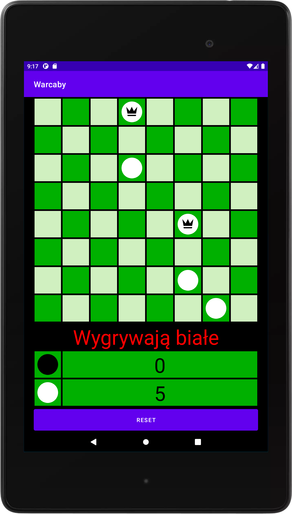

# Warcaby
Gra polega na zbiciu wszystkich pionków przeciwnika. 
Gra zgodna z zasadami wersji angielskiej. 
1. Zwykły pionek może bić oraz poruszać się tylko do przodu. 
2. Bicie jest wymagane. 
3. Zwykły pionek po dotarciu do drugiego końca planszy zamienia się w damę. 
4. Dama porusza się o jedno pole we wszystkich kierunkach z wyjątkiem wielokrotnego bicia. 

Tworzona w środowisku programistycznym Android Studio i testowana pod urządzeniem o rozdzielczości 1200x1920. 

